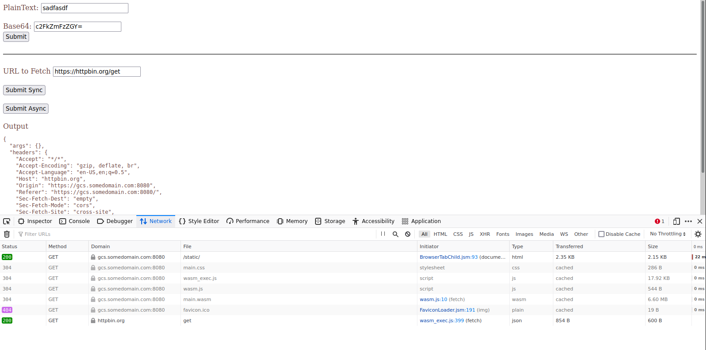

## Browser WebAssembly with golang http client


I was looking into webassembly again today in the hope of somehow using it to call `Google Cloud Storage` using its own [go SDK client libraries](https://github.com/googleapis/google-cloud-go/blob/main/storage/storage.go). 

I got that to work and will have a followup post about it.  ..but..

Along the way to set that up, to my surprise i found out that golang's [net/http](https://pkg.go.dev/net/http) clients actually work within _browser wasm_.  This was really interesting and didn't think it was possible due to the wasm sandbox in the browser

I only stumbled across that after reading `Alessandro Segala's` excellent blog here:

*  [Go, WebAssembly, HTTP requests and Promises](https://withblue.ink/2020/10/03/go-webassembly-http-requests-and-promises.html)

I decided to implement that end-to-end and write a small sample on my own derived from his work and from `Omri Cohen's` [Run Go In The Browser Using WebAssembly](https://dev.bitolog.com/go-in-the-browser-using-webassembly/).

Basically, this sample code here shows you how to compile and run a go-webassembly that does two things:

* convert some text to base64
* fetch an external resource in direct and streaming modes.

Both these are again derived from the the references above so this really isn't anything i did...i just documented it as an end-to-end sample.

---

Creating a go-webassembly app is nothing new...even i did one a couple weeks back that is outright impractical:

* [A simple soroban using WebAssembly and Homomorphic Encryption](https://github.com/salrashid123/wasm_homomorphic_encryption)

Note, this is about _browser_ wasm ...not wasm running in a proxy like `Envoy`...that has a lot more capabilities and can surely make http or even gRPC api calls on its own:

* [Envoy WASM and LUA filters for Certificate Bound Tokens](https://github.com/salrashid123/envoy_cert_bound_token)
* [Envoy WASM with external gRPC server](https://github.com/salrashid123/envoy_wasm)

What the issue i'm demonstrating here is _browser_ wasm making an http call in go.  Why is that so difficult?  well, wasm in the browser is itself prohibited from making http requests....but....the following [PR jL9Lyma0nmo](https://groups.google.com/g/golang-codereviews/c/jL9Lyma0nmo) allowed go's `net/http` package to call javascrpts [fetch()](https://developer.mozilla.org/en-US/docs/Web/API/Fetch_API/Using_Fetch) _transparently_.

That is, whenever an http client in go is used in browswer, wasm, it internally calls `fetch()`....its interesting that this workaround exists but i'm not complaining!

If you want to read up on _how_ this works internally or the specifics of the streaming fetch capability, please see the documentation and the PR cited above...i'll just focus on getting the impatient up and running...


#### Setup

Anyway, lets set this up so you can run locally

I'm using `https` for the webserver which you will run and due to the certs, its just as easy if you setup a local redirect:

set in `/etc/hosts`:

```
127.0.0.1 gcs.somedomain.com
```

Now, just compile the wasm if you want to

compile

```bash
GOOS=js GOARCH=wasm go build -o  server/static/wasm/main.wasm  main.go
```

Now run the webserver

```bash
cd server
go run server.go
```

Note that the webserver loads wasm

- `index.html`, see

```javascript
	<script src="js/wasm.js" defer></script>
```

where we got `wasm_exec.js` from [here](https://raw.githubusercontent.com/golang/go/refs/tags/go1.21.0/misc/wasm/wasm_exec.js)

which inturn bootstraps the `main.wasm` file:

```javascript
'use strict';

const WASM_URL = 'wasm/main.wasm';

var wasm;

function init() {
  const go = new Go();
  if ('instantiateStreaming' in WebAssembly) {
    WebAssembly.instantiateStreaming(fetch(WASM_URL), go.importObject).then(function (obj) {
      wasm = obj.instance;
      go.run(wasm);
    })
  } else {
    fetch(WASM_URL).then(resp =>
      resp.arrayBuffer()
    ).then(bytes =>
      WebAssembly.instantiate(bytes, go.importObject).then(function (obj) {
        wasm = obj.instance;
        go.run(wasm);
      })
    )
  }
}

init();
```

Ok, lets access the browser.  In an incognito window, goto `https://gcs.somedomain.com:8080/static/`.  Ignore the cert warning

Test base64 encoding with wasm:

* enter `PlainText`, click submit


Test direct fetch or streaming.

* Click the corresponding "Submit" buttons.

The streaming one will read chunks of data and output it to javascript-land while the sync one will read the fetch results into memory before returning.  It'd be better if you use streaming since you probably dont' want to OOM wasm runtime.




---

#### TinyGo

We're using plain go to compile into wasm...i tried to use `tinygo` but i didn't work

There would've been a small savings here interms of size:

```bash
$ GOOS=js GOARCH=wasm go build -o  server/static/wasm/main.wasm  main.go
$ ls -larth server/static/wasm/main.wasm
   6.6M Mar 21 13:09 server/static/wasm/main.wasm

$ tinygo build -o server/static/wasm/main.wasm -target wasm ./main.go
   4.3M Mar 21 13:07 server/static/wasm/main.wasm
```


